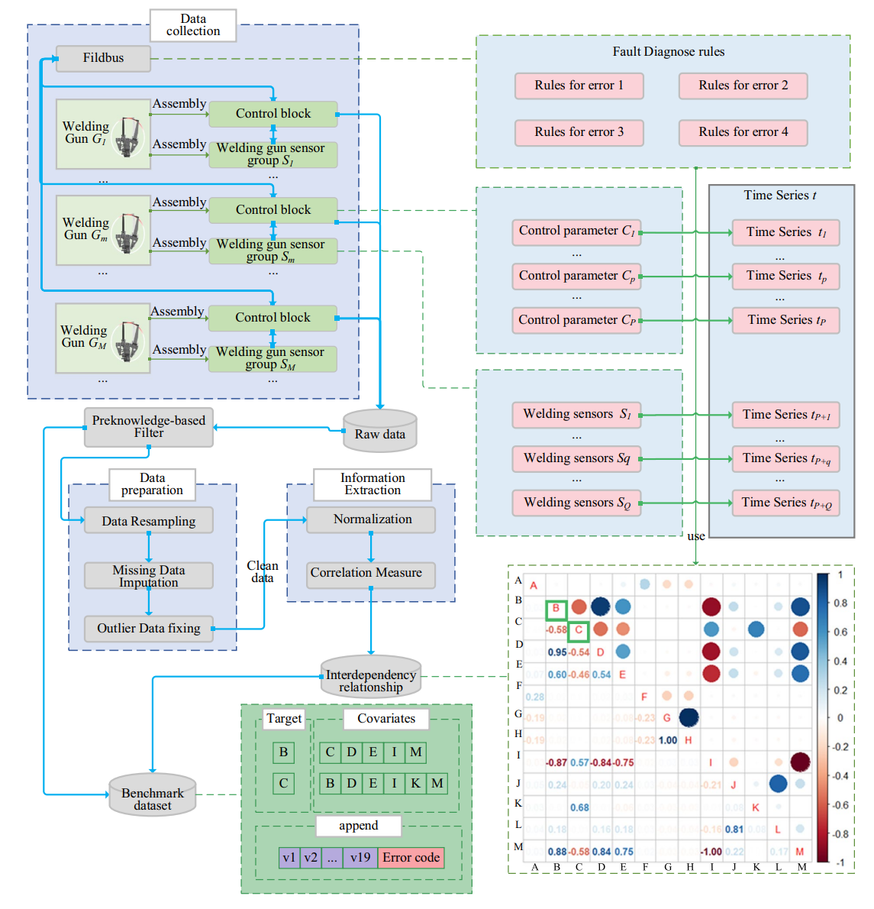

### 0. 데이터 파일

https://drive.google.com/drive/folders/10u8Z5YJIqq2KRrzuE7Jn9QsCtgTgLftQ?usp=sharing

### 1. 논문 리뷰

##### 논문개요
- 자동차 제조업에서 광범위하게 쓰이는 **저항 점용접기(RSW)의 고장을 예측**하기 위한 다변량 시계열 데이터셋, 실제 차체 공장에서 **3년 이상 가동된 수십대의 용접기로부터 수집된 데이터**

- 용접기의 제어 오류는 예기치 않은 가동 중단을 유발하므로 과거 관측 데이터를 통해 사전에 기계적 결함을 **예측하고 유지보수 전략을 세우는 것이 핵심**

**데이터 수집과정**



**데이터 설명**

- 컬럼 : time / c01-19 / error(target) (총 21개)
- 행 : 1hz(1sec)주기로 7일정도 (총 60만개 정도) / 기간은 에러별로 다름
- train : E01, E02, E03, E04가 각각 00부터 17까지 18개씩 (총 72개)
- test : test00-07 (총 8개)
>> Dataset 양 자체는 sufficient (4800만 행)
>> 어느정도 환경이면 ML이나 1D CNN정도는 수월하게 돌아감

파이프라인 시사점: 우리는 이 'Diagnose rules'를 모델에 직접 넣는 것이 아닙니다. 이 규칙을 통해 도출된 최종 결과물인 에러(E01~E04)를 모델의 '정답(Target)'으로 삼아 센서 데이터 패턴과 역산하여 매핑(Classification)하도록 학습시켜야 합니다.
이 2-way 메커니즘이 이해가 안될시 실제 데이터를 열어보며 확인할것.

**논문 설명 발췌**

The leading car manufacturer has been relying on the pinpoint accuracy
and efficiency of servo-pneumatic welding guns for many years

The resistance spot welding (RSW) welding gun fault prediction benchmark data set has **72 multivariate time series in the training set and 8 in the testing set.** Each time series length 604800(apx.) sampled at 1 Hz with missing values and has 20 dimensions (c1-c19 and the error code). We retain the missing value and the outliers of the welding gun time series for the potential of imputation research in the future.

RSW guns are highly nonlinear dynamical machinery systems with interesting physical phenomena over multiple time-dependent components.

This dataset is suitable for a **time series forecasting task**, where machine learning models can be **trained to predict future welding parameters based on the provided welding parameters time series in history.** 

The dataset contains real-world multivariate time series data over 3 years from 80 RSW guns running at the production line of the body-shop of a leading car manufacturer

- time : time detail 참고

- **센서 파라미터 (19종)**
차체 공장의 영업 비밀 및 지적 재산권 보호를 위해 **19개 센서 파라미터의 정확한 명칭을 의도적으로 마스킹하여 $c1 \sim c19$ 로 표기**
c1 :  Electrode cap offset;
c2 :  Electrode force;
c3 :  Electrode position;
c4 :   Force build-up;
c5 :  Balance pressure;
c6 :  Friction;
c7 :  Maximum aperture;
c8 :  Maximum electrode force;
c9 :  Mtart friction;
c10 :  US2;
c11 :  Welding point count;
c12 :  Position count;
c13:  Setpoints of counterbalance pressure;
c14:  Setpoints of electrode force;
c15 :  Setpoints of electrode position;
c16:  Setpoints of sheet thickness;
c17 :  Setpoints of velocity;
c18:  Setpoints of force build-up;
c19 :  Offset value in robot.
>> 도메인지식 추후에 알아서 해야할듯

>> 마스킹되어서 얼마나 더 세세한 분석이 가능할지 모르겠으나 벤치마킹 코드를 통해 추론가능한게 몇가지 있음.
>> 예를 들어 특정 변수($c16$)의 경우 두께 측정과 관련이 있으며 특정 임계값(예: 6 초과)을 넘어서면 용접 외 작업(캡 교체 등)으로 발생한 노이즈로 간주할 수 있다는 점

- **타겟변수 (error)**

 0, E001, E003, E006, E007, E009, E010, E011, E012, E016, E028, E029
아래의 5가지 상태를 의미하는게 아니라 중단 전 일종의 신호로 보는게 맞을듯 (1-step으로 예측하는것것)

- **5가지 상태, 4가지 파일 (E00-E04)**

| **에러 코드** | **상태 명칭**                             | **발생 조건** (단순번역, 도메인지식이 없음)        |
| --------- | ------------------------------------- | ---------------------------------- |
| **E01**   | Counterbalance timeout (카운터밸런스 시간 초과) | 지정된 보상 압력에 1800ms 동안 도달하지 못함       |
| **E02**   | Electrode broke (전극 파손)               | 전극 위치가 기준 이동의 영점보다 작음              |
| **E03**   | Unwanted Movement (원치 않는 움직임)         | 실제 위치 값이 실린더 스트로크의 6.5%를 초과하여 이탈함  |
| **E04**   | Drift (표류/이탈)                         | 잠긴 실린더가 정지하지 않고 분당 5mm 이상의 속도로 움직임 |
| **E00**   | Normal state (정상)                     | 에러가 발생하지 않은 정상 작동 상태               |
>> E00케이스에 대한 파일은 없고, 4가지 anomal 케이스에 대해서만 18개 train파일이 존재
>> 각 파일 (E01_01.csv)는 에러(E01)이 발생한 시점으로부터 7일 전까지 시계열 데이터를 가짐

- 센서 통신망의 패킷 손실 등으로 인한 **결측치와 정상적인 용접 과정 외의 동작으로 발생한 이상치를 그대로 포함**함. 실제 산업 환경의 **불완전한 데이터를 다루는 강력한 예측 모델 개발을 장려**하기 위해 이러한 노이즈를 데이터셋에 의도적으로 남겨두었다고 함

>> 본 데이터셋 활용 확정시 모델정확도를 위한 전처리(보간)를 할지 / 똑같이 robustness를 위해 남겨둘지는 생각해봐야 할 부분
>> 
>> 아직 feature engineering, 모델 테스트는 안해봐서 모르겠음

### error 컬럼과 파일명 (중대 정지사유 E01, 02, 03, 04)은 별개의 사항

**`error` 컬럼 (0, E001, E016...): 1초마다 기록된 '실시간 내부 상태 로그 (Event Log)'** CSV 안의 `error` 컬럼은 1Hz(초당 1회) 주기로 센서가 수집될 때 기계 시스템이 내뱉은 날것의 상태 코드입니다.

E001, E016, E028 같은 수많은 코드들은 기계를 멈출 정도는 아니지만 가동 중 발생했던 자잘한 경고, 일시적인 통신 불량, 유지보수 알림 등 기계 내부의 '알 수 없는 상태나 이벤트'를 지칭하는 것이 맞습니다. 이 데이터셋에는 실무 환경의 노이즈와 작동 상태가 의도적으로 그대로 남아있기 때문입니다.

우리가 만들 모델(AI 감독관)은 CSV 내부의 `error` 컬럼에 있는 20개가 넘는 자잘한 코드들을 모두 맞추는 것이 목표가 아닙니다.

오히려 `error` 컬럼에 E016, E028 같은 **잔고장 알림이 평소보다 얼마나 자주 등장하는지를 일종의 '전조 증상(Feature)'으로 활용**하고, 최종적으로 이 센서 흐름이 'E01이라는 대형 고장(파일명)으로 이어질 것인가, 아니면 정상(E00)으로 끝날 것인가'를 판별하도록 학습시키는 것이 가장 효과적인 접근입니다.

>> 이 데이터셋으로 진행한다고 할때 재미있을거같긴한데 난이도가 상당히 높아보여서 해낼수있을지 잘 모르겠음 (실력적인거 + 이 마스킹된 제한된 정보로 가능할지 + 데이터 구성에 대한 이해도 부족)
>> 
>> 그래서 이걸 멘토님께 여쭤보고 멘토님이 1. 데이터를 제공해주실 수 있고 2. 더 퀄리티가 좋고 3. 더 분석가시성(활용성) 이 있다면 그걸로 가고
>> 아니라면 이 데이터셋으로 가는게 좋을듯
>
>이런식의 자료구조의 2-step 구조는 경험해본적이 없지만 benchmark code가 있어서 참고할수 있을것같ㅌ기도

### 2. 접근방식

- 논문에선 고장여부를 바로 분류하는 대신
**1. 타겟 파라미터(전극 압력, 밸런스 압력 등)로 미래 수치 (혹은 잔고장 'error')를 시계열로 예측**한 뒤
**2. 기존의 고장 진단 규칙과 매핑하는 Two-stage** 방식을 채택했음

- ML, DL모델 적용한 평가결과 
1. 시계열 예측 정확도 면에서는 **TFT(Temporal Fusion Transformers)**와 **Random Forest**가 가장 우수한 성능
2. 단순 RNN 구조 역시 여러 평가지표에서 훌륭하고 안정적인 성능을 기록했습니다.


- 근데 논문에서 예측된 수치를 바탕으로 실제 고장 여부를 분류해 본 결과 **높은 오알람(위양성)** 을 보임
  **평균 정확도는 68.62%**
  **정상 상태를 고장으로 오인하는 비율은 56%** 

>> 기존 2-stage 방식을 채택적용하기 어렵다고 생각한 이유가 이부분
>> 
> 미래 60초간의 센서 수치를 먼저 시계열로 예측(Stage 1)한 뒤 
> 예측된 수치에 고장 진단 규칙을 적용(Stage 2)하기때문에 오류가 누적되는게 심함
> 
> 현실적으로 실력이 안됨
> 
> 그래서 
> 센서를 예측하고 오류를 예측하는 방식 >>> 곧바로 에러를 예측하는 1-step으로 예측
> 하는 최적화로 에러를 줄이는 방법을 생각해봐야할듯 (아직 테스트해보지는 않음)


>> 결론적으로
>> 1. 이상치, 결측치를 그대로 냅둔것이 모델오류에 일부기여
>> 2. 2단계 처리방식에서 오류가 쌓이는게 총체적으로 일부기여
>>    
>>  따라서
>> - 필요에 따라 이상치 결측치 처리를 하고, single step으로 에러를 분류, 예측하기
>> - 데이터 양은 모델학습시키는데 충분하고 EDA를 보니 충분히 학습시킬정도로 유효하나, 이정도 양의 시계열데이터는 처리해본적이 없어서 여러 method를 고안해봐야할듯.
>>   
>>  50%는 전처리에, 30%는 학습 및 튜닝에, 20%는 뒷부분 연결에 투자하게 될것가틈

### 3. 그 후 모델데이터 처리를 해서

내가 이해한게 맞다면

1. 필터링된 강력한 이상 시그널이 탐지 혹은 예측되면 (output : E01-04) Root Cause Agent로 전달
2. Agent는 이상 감지 시점 앞뒤의 센서 데이터수치나  로그 스트림을 수집해서 컨텍스트로 구성
3. 동시에 E01(카운터밸런스 1800ms 시간 초과), 
   E02(전극 위치 영점 이탈 파손), 
   E03(스트로크 6.5% 초과 원치 않는 움직임), 
   E04(분당 5mm 이상 표류/이탈) 등 감지된 에러 코드에 부합하는 지침서/매뉴얼을 Vector DB에서 RAG 방식으로 검색해 가져옴
4. LLM (API활용 예정?) 은 이상 패턴과 검색된 텍스트 매뉴얼을 융합하여 장애 원인, 영향도, 그리고 수정 조치 가이드를 자연어로 추론하고 요약

추후

- 최종적으로 작업자에게 Slack을 통해 심각도, 이상 항목, 요약 원인이 포함된 실시간 경고 알림을 전송
- 필요에 따라 Markdown 또는 PDF 형태의 1-Page 장애 분석 리포트를 자동으로 생성하고 발행하여 즉각적인 보고 체계구축

- 이상 탐지 시그널을 RAG로 보낼 때 너무 예민하게 알람이 울리면 피로도가 높아지기 때문에 논문의 Baseline(RF, TFT)보다 오탐지율을 낮출 수 있는 모델 개선이나 일정 횟수 이상 이상치가 연속 발생할 때만 RAG 리포팅을 트리거하는 식의 임계치로직 개선처리가 필요할듯.

- **매뉴얼 RAG 구성:** 에러 코드별 발생 원인이 명확하므로 E01~E04 각각의 조치 매뉴얼과 정비 지침서를 Vector DB에 넣어두면 모델이 시그널을 던질 때 훌륭한 LLM 원인 분석 리포트가 완성될듯. 다만 매뉴얼이 어떤식으로 주어지는지를 봐야할듯 (명확하게 특정 에러에 대한 정답(해결책)이 있는지)

---

### 4. 데이터 디테일

- **결측치(Missing Rate)의 극단적 편차:** 실제 통신망 패킷 손실로 인해 데이터 갭이 존재합니다. 
  E01, E03, E04 파일들은 결측률이 대체로 0.6% ~ 2.5% 수준으로 양호합니다. 
  반면 E02 폴더의 일부 파일(`E02_0` 81.36%, `E02_4` 82.06%, `E02_6` 84.46%)은 수집 기간 중 센서 통신이 거의 단절된 심각한 결측률을 보입니다.

- **수집 시기의 차이:** E01, E03, E04 파일들은 주로 2021년 8월 ~ 10월에 집중되어 있습니다. 
  그러나 E02 파일들은 2019년 12월 ~ 2020년 7월 데이터가 다수 섞여 있습니다.

- **타겟 변수의 이진화 (Binary Target Mapping)** 20개가 넘는 에러 코드를 모두 예측하는 모델을 만들면 정상 상태를 오인하는 등 오알람(False Alarm)이 지나치게 많아집니다. 파일의 마지막 시점(메인 고장 발생 시점)에 집중적으로 기록되는 특정 코드만 '치명적 고장(Target = 1)'으로 정의하세요. 그리고 가동을 멈추지 않는 잔고장 코드들과 `0`은 모두 '정상(Target = 0)'으로 병합하여 이진 분류 문제로 단순화하는 전처리가 필요합니다.

- **잔고장 로그를 '입력 피처(Feature)'로 전환** 자잘한 에러(예: E016 등)가 반복해서 튀는 현상 자체가 곧 큰 고장이 날 것이라는 훌륭한 전조 증상일 수 있습니다. 따라서 `error` 컬럼을 단순한 정답지로 버리지 말고, **"최근 10분간 발생한 마이너 에러 누적 횟수"** 와 같은 시계열 파생 변수(Feature)로 만들어 모델의 입력값으로 쓴다면 분류 성능을 크게 끌어올릴 수 있습니다.

- 사소한 문제 : E02_2 데이터가 없어서 demo로 대체했음

---

### 5. 구현 워크플로우 (2026-09-22 기준)

```
train/*.csv ──► .py/eda.py ──► eda_out/          (탐색, 전처리 규칙 근거)
     │
     └──────► .py/preprocess.py ──► preprocessed/*.parquet + scaler.json
                                          │
                                          ▼
                                   .py/train.py ──► models/baseline_iforest.joblib
                                                            │
                                                            ▼
                               main.py (FastAPI) ──► AnomalyResult JSON ──► 온톨로지 / RAG 단계
```

| 파일 | 역할 | 입력 → 출력 |
|---|---|---|
| `.py/Benchmark.py` | 논문 벤치마크 원본 (Zenodo) — 참고용, 실행 불가 | — |
| `.py/Benchmark_fixed.py` | 원본의 버그만 고친 재현본 (Stage 1 시계열 예측) | `train/`,`test/` → `results/` |
| `.py/eda.py` | 72개 학습 파일 EDA | `train/` → `eda_out/` |
| `.py/preprocess.py` | 이상탐지용 전처리 | `train/` → `preprocessed/` |
| `.py/train.py` | 이상탐지 베이스라인 학습·평가·저장 | `preprocessed/` → `models/` |
| `main.py` | 실시간 추론 API | `models/` + 센서 스트림 → JSON |

모든 스크립트는 경로를 `__file__` 기준(프로젝트 루트)으로 잡으므로 어느 디렉터리에서 실행해도 된다.

#### 5.1 벤치마크 코드 리뷰 (`Benchmark.py` → `Benchmark_fixed.py`)

원본은 그대로 실행되지 않는다. 고친 것:

- 모든 플롯이 `predl_NBEATS`(마지막에야 정의됨)를 그림 → `NameError`
- 테스트 시계열 전체를 넣고 그 **끝 이후**를 예측해 실측과 겹치는 구간이 없음 → 마지막 `N_PRED`초를 홀드아웃
- PNG 파일명이 `file_name[-4:]`(=".csv")라 테스트 파일끼리 덮어씀
- `accelerator="gpu"` 하드코딩(이 PC는 CPU torch) → `"auto"`
- TFT는 future covariate가 없으면 `add_relative_index=True` 필요
- `darts.mape`는 실측에 0이 있으면 예외(c2·c4는 50~85%가 0) → NaN 처리, MARRE 추가
- pandas 2.x에서 제거된 `resample('S')`, `fillna(method=)`, `to_numeric(errors='ignore')`
- 선행 결측 bfill, 이상치 마스킹을 원-핫 **이전**에 수행, 죽은 `switch` 로직 제거
- 논문 규칙대로 결측률 40% 초과 파일 폐기

10개 모델 전체 학습은 수십 시간 규모라 축소 스모크 테스트만 시도했고, 메모리 부족으로 중단되어 **학습~평가 경로는 아직 실측 검증되지 않았다**(임포트·API 명·경로만 확인).

#### 5.2 EDA (`python .py/eda.py`, 72파일 약 40분)

산출물: `eda_out/eda_report.md`(요약), `file_summary.csv`, `error_episodes.csv`, `scm_*.csv`, `01~09_*.png`, `files/<파일>.png`

핵심 발견 — 전처리·모델링 결정의 근거:

| 발견 | 수치 | 결정 |
|---|---|---|
| 결측은 행 단위 block-out | E01/03/04 ~1%, gap 99%가 ≤35초, 최장 ~1h. **E02 8개 파일이 64~84%** | 40% 초과 폐기(논문), ≤60초 ffill, 긴 gap은 세그먼트 분리 |
| c16 이상치 = 캡 드레싱 | 파일당 1~45%, 평균 11% | 센서값 carry-forward + `non_welding` 플래그 |
| **error 컬럼은 이벤트가 아니라 상태** | E003 에피소드 중앙값 1.5~2h, 최장 28h | 에피소드 단위 집계, `error_active`/`error_share_10min` 피처 |
| 클래스별 종료 코드가 거의 결정적 | E01→E012 18/18, E02→E016 17/18, E03→E028 18/18, E04→E029 18/18 (모두 고장 전 10분 내) | `terminal_code` 플래그, API의 `known_code_class_hint` |
| c7·c8·c9는 파일 내 상수 | 69/72 파일 | 건 고유 속성(정적 공변량), `--drop-static` 옵션 |
| c11·c12는 누적 카운터 | 절대값이 건마다 다름 | 증분 + 10분 롤링 합으로 대체 |
| 수집 시기 | E02 일부는 2019-12~2020-07, 나머지는 2021-08~10 | 타임라인 확인용 `04_collection_timeline.png` |
| 타깃 상관 | c2↔c4 +0.94, c2↔c18 +0.89, c2↔c13 −0.88 | 논문 SCM 재현(`scm_overall.csv`) |

readme 2절의 "잔고장 코드를 전조 피처로" 가설은 절반만 맞다: 종료 코드는 고장 10분 전에야 나타나고, E003·E011·E029는 며칠 전부터 장시간 지속되는 상태라 단독 전조로는 약하다.

#### 5.3 전처리 (`python .py/preprocess.py`, 약 5분)

출력: `preprocessed/<파일>.parquet`(1 Hz, float32), `manifest.csv`(파일별 행·세그먼트·폐기 사유), `scaler.json`(정상행 z-score 파라미터), `preprocess_config.json`

컬럼: `file, class, gun, segment_id` · 센서 `c1~c9, c13~c19`(z-score), `c10`(0/1) · 파생 `welds_delta, pos_delta, welds_10min, weld_duty_10min, error_share_10min, hour_sin, hour_cos, dow` · 상태 `error_code, error_active, terminal_code, non_welding` · 레이블 `ttf_s`(고장까지 초), `label`(마지막 3600초=1)

주요 옵션: `--max-missing-rate 0.4`, `--gap-fill-limit 60`, `--pre-failure-window 3600`, `--resample 10s`, `--scale global|per-file|none`, `--drop-static`

결과: 64/72 파일, 37.6M행. 스케일러는 `label==0 & error_active==0` 행으로만 fit.

#### 5.4 이상탐지 베이스라인 (`python .py/train.py`)

- 60초 윈도우로 집계(연속 피처 24개 × mean/std = 48 피처, ~60만 윈도우), **파일(=건) 단위** 층화 분할 25% 검증
- IsolationForest(300 trees), 정상 윈도우(`label==0 & error_active==0`) 464,816개로 학습
- 임계값 = 학습 정상 점수의 99% 분위수(0.5406)

검증(16개 건, 고장 전 1h vs 정상):

| | AUROC | recall@1h | 정상 알람률 |
|---|---|---|---|
| 전체 | 0.639 | 0.051 | 0.015 |
| E01 | 0.687 | 0.016 | 0.001 |
| E02 | 0.789 | 0.298 | 0.058 |
| E03 | 0.633 | 0.004 | 0.018 |
| E04 | 0.589 | 0.008 | 0.004 |

→ 오탐률은 설계대로 1%대지만 **고장 전 1시간을 거의 못 잡는다**. 기준선일 뿐이다.

저장: `models/baseline_iforest.joblib` = `{model, feature_cols, model_cols, window, threshold, sustain, scaler, feature_reference, metrics, train/val_files}`. 추론은 `from train import load_bundle, score_frame` 또는 `python .py/train.py --score preprocessed/E04_3.parquet`.

#### 5.5 실시간 추론 API (`uvicorn main:app --reload`)

| 메서드 | 경로 | 역할 |
|---|---|---|
| POST | `/predict` | `{gun_id, readings:[SensorReading]}` → 건별 30분 버퍼에 추가, 최신 60초 윈도우 스코어링. 60초 미만이면 `202 warming_up` |
| GET | `/model`, `/health`, `/guns` | 모델 카드 / 상태 / 건별 버퍼·연속 알람 |
| DELETE | `/guns/{gun_id}` | 버퍼 리셋 |

입력 `SensorReading`은 CSV 컬럼 그대로(`time, c1~c19, error`; `c10`은 on/off·bool 허용, `error`는 `^(0|E\d{3})$`). 서버가 전처리를 온라인으로 동일 적용한다.

출력 `AnomalyResult`(온톨로지 단계 입력):

```json
{"gun_id": "G0", "status": "ok", "window_start": "...", "window_end": "...", "n_samples": 60, "history_s": 1809,
 "is_anomaly": true, "anomaly_score": 0.61, "threshold": 0.54, "score_z": 4.6,
 "severity": "critical", "sustained_alarm": true, "consecutive_alarms": 3,
 "contributing_features": [{"feature": "c5_mean", "sensor": "c5", "sensor_name": "Balance pressure",
                            "statistic": "mean", "value": -3.1, "reference": 0.02, "contribution": 0.08, "share": 0.41}],
 "context": {"latest_error_code": "E029", "error_active_share": 1.0, "non_welding_share": 0.0,
             "welds_in_window": 0, "welds_10min": 12, "weld_duty_10min": 0.02, "known_code_class_hint": "E04"},
 "model": {"name": "baseline_iforest", "type": "iforest", "window_s": 60, "threshold": 0.54, "sustain": 3, "n_features": 48}}
```

- `severity`: `normal`(임계 미만) / `warning`(초과) / `critical`(`sustain`=3회 연속 초과) — 3절의 "연속 N회일 때만 RAG 트리거" 기준
- `contributing_features`: 각 피처를 정상 기준값으로 치환했을 때 점수 감소량(모델 무관), 상위 8개
- 요청당 ~60 ms(1,100행 append 포함)

#### 5.6 현재 한계와 다음 단계

1. 현재 `models/baseline_iforest.joblib`은 `feature_reference` 추가 **이전**에 학습된 것이라 API의 기여도 기준값이 0으로 대체된다 → `python .py/train.py` 재학습 필요.
2. 베이스라인은 종료 상태(E029 등)조차 임계값 아래로 본다. 시도할 것: `preprocess.py --scale per-file --drop-static`(건 간 오프셋 제거), 윈도우 길이 확대, 시퀀스 모델(LSTM-AE 등), 그리고 `label`을 쓰는 지도학습 비교.
3. E01_0은 고장 직전 1시간의 85%가 `non_welding` — 고장이 정비 중 발생하는 패턴인지 72파일에서 확인해야 하며, 그렇다면 `non_welding`을 입력에서 빼야 모델이 플래그만 외우지 않는다.
4. 서빙 윈도우는 트레일링 60초, 학습 윈도우는 분 경계 정렬 — 정확히 맞추려면 서빙도 분 경계로 자른다.
5. `Benchmark_fixed.py`의 실제 학습 경로는 미검증.
